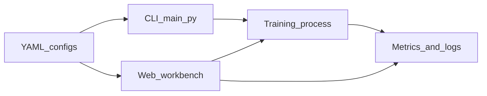

# EdgeDistillDet 功能介绍

本文档从**能力与使用场景**角度说明 EdgeDistillDet 能做什么、各模块如何协作。安装步骤、命令参数与 HTTP 接口清单仍以仓库根目录 [README.md](../README.md) 为准；版本号以 [`main.py`](../main.py) 中的 `__version__` 为唯一来源（与 `GET /api/version` 一致），发版记录见 [CHANGELOG.md](../CHANGELOG.md)。

---

## 1. 项目定位与价值

EdgeDistillDet 是一套**面向边缘部署场景**的微小目标检测方案：在 Ultralytics YOLO 检测流水线之上，通过**教师–学生知识蒸馏**与自适应损失调度，在保持可部署体积与推理成本的前提下提升小目标表现；同时提供**统一命令行**与**本地 Web 工作台**，用 YAML 配置贯穿训练、评估、数据分析与边缘侧可行性评估。

**典型适用场景**：需要在 RK3588、昇腾 310、通用 CPU/GPU 等目标形态上部署轻量检测模型；数据集中小目标占比高、希望用较大教师网络蒸馏到较小学生网络；希望在同一套配置下完成实验管理、日志与指标查看，并借助 Agent 辅助理解与修改配置。

---

## 2. 功能总览

| 能力域 | 说明 |
|--------|------|
| **蒸馏训练** | 基于 `AdaptiveKDTrainer`，集成 YOLO 训练循环，支持软标签蒸馏、小目标加权、特征对齐与自适应 α/温度调度。 |
| **Benchmark 评估** | 按评估配置对多组权重与测试集进行指标汇总（见 `core/evaluation` 与 `scripts/evaluate.py`）。 |
| **数据集分析** | 对数据集做统计与可视化输出，便于了解尺度与分布（`analyze` 子命令）。 |
| **边缘剖析** | 基于内置设备规格与模型体量，给出理论吞吐、内存与量化收益等**部署前参考**（`profile` 子命令）。 |
| **本地 Web UI** | FastAPI 后端 + React 前端：训练配置、指标监控、Agent 三栏工作台；默认仅本机访问。 |
| **Agent 辅助** | 对蒸馏相关 YAML 做补丁校验、预览、应用，以及运行历史与回滚；支持工具契约执行与模型调用（含流式）。 |

---

## 3. 命令行（CLI）

入口为 [`main.py`](../main.py)，子命令与脚本对应关系如下。

### 3.1 `train` — 蒸馏训练

- **作用**：读取蒸馏训练配置并启动 `scripts/train_with_distill.py` 中的流程。
- **配置**：默认 `configs/distill_config.yaml`。主要块包括：
  - **`distillation.*`**：学生/教师权重路径、`alpha_init`、温度上下界 `T_max` / `T_min`、`w_kd` / `w_focal` / `w_feat`、`scale_boost`、`focal_gamma`、`distill_type` 等，与 [`core/distillation/loss_functions.py`](../core/distillation/loss_functions.py) 中的组合损失项对应。
  - **`training.*`**：数据集 YAML、设备、轮数、图像尺寸、batch、增强与 AMP、学习率相关项；还可配置 **`compute_provider`** 以及 **`cloud_api`** / **`dataset_api`**，用于在本地算力与远程/云编排之间切换（详见示例配置 `configs/distill_config_cloud_example.yaml`、`distill_config_remote_api_example.yaml`）。
  - **`output.*`**：实验目录与日志路径。
  - **`wandb.*`**：可选实验跟踪。
- **断点续训**：`--resume` 可指向具体 checkpoint，或使用 `auto` 由流程自动解析（与训练器对 Ultralytics checkpoint 的约定一致）。

### 3.2 `eval` — 评估

- **作用**：按 [`configs/eval_config.yaml`](../configs/eval_config.yaml) 对指定权重列表与测试数据 YAML 运行评估，结果可输出到 CSV 等（字段以当前评估脚本为准）。

### 3.3 `analyze` — 数据集分析与可视化

- **作用**：对给定数据集根目录做分析，并将图表等输出到指定目录（适合实验前快速了解数据）。

### 3.4 `profile` — 边缘部署剖析

- **作用**：载入权重，针对目标设备类型生成**理论向**的部署参考（非替代真实板端实测）。
- **设备关键字**（与 [`utils/edge_profiler.py`](../utils/edge_profiler.py) 一致）：`rk3588`、`ascend310`、`cpu`、`gpu`。
- **报告维度**：内置设备规格、基于体量与算力假设的吞吐上限估算、多精度下的内存占用粗估、量化收益与可行性分级（PASS / WARN / FAIL）等，具体以剖析器实现与日志输出为准。

---

## 4. 蒸馏与训练核心（概要）

实现集中在 [`core/distillation/adaptive_kd_trainer.py`](../core/distillation/adaptive_kd_trainer.py) 与 [`core/distillation/loss_functions.py`](../core/distillation/loss_functions.py)。

### 4.1 训练器设计取向（与 Ultralytics 协同）

- **集成方式**：在 Ultralytics 检测训练流程上挂载蒸馏逻辑，尽量**复用学生侧已由框架计算的前向结果**，避免重复前向，降低显存占用并简化断点续训时的模型生命周期管理。
- **稳定性**：断点续训时对 checkpoint 与 `YOLO` 实例的创建方式有专门处理；蒸馏损失与 trainer 的绑定需在整个 resume 周期内保持有效（实现中通过全局路由表等机制保证新模型仍能关联到当前 trainer）。

### 4.2 自适应蒸馏权重（`AdaptiveAlphaScheduler`）

- **作用**：根据任务损失等信号的滑动统计，在允许范围内动态调节蒸馏项权重 **α**，使任务学习与知识迁移之间保持平衡；上下界与步长等由训练器与配置共同约束。

### 4.3 温度调度（`CosineTemperatureScheduler`）

- **作用**：蒸馏温度在训练过程中按**余弦式**规律在 `T_max` 与 `T_min` 之间变化（与 `distillation` 配置中的 `T_max`、`T_min` 及总轮数关联），软化或锐化教师分布，从而影响蒸馏难度。

### 4.4 组合损失（`CompositiveDistillLoss`）

- **组成**：默认组合 **自适应温度 KL 类蒸馏**（`AdaptiveTemperatureKDLoss`，含小目标加权思想）、**小目标 Focal 风格蒸馏项**（`SmallTargetFocalKDLoss`），以及在提供学生/教师通道配置且 `w_feat > 0` 时启用的**特征对齐**（`FeatureAlignmentLoss`）。
- **与 YAML 的对应关系**：`w_kd`、`w_focal`、`w_feat` 为三项加权系数；`temperature`、`scale_boost`、`focal_gamma` 等进入各子损失；不同骨干/头维度差异通过特征对齐与张量规范化逻辑处理，减少「教师–学生」结构不一致带来的数值问题。

---

## 5. 本地 Web 工作台

### 5.1 启动与访问

- **启动**：`python web/app.py`（见 [`web/app.py`](../web/app.py)）。
- **默认监听**：`127.0.0.1:5000`（仅本机）；生产静态资源需先在前端目录执行构建，生成 `web/static/dist/app.js` 与 `app.css`，详见 README。

### 5.2 界面结构

前端入口为 [`web/src/App.jsx`](../web/src/App.jsx)，侧边栏包含三个功能区：

1. **训练配置**：选择/编辑 YAML、保存与上传、检查输出目录、启动与停止训练、查看日志与续训候选等（对接 `config`、`train` 相关 API）。
2. **指标监控**：轮询训练指标与曲线类展示（对接 `metrics` 路由）。
3. **Agent**：在受控流程下对配置做补丁与历史回滚，并调用后端提供的工具与模型接口（对接 `agent` 路由）。

支持**浅色 / 深色**主题切换，主题偏好保存在浏览器本地存储。

### 5.3 后端装配

[`web/app.py`](../web/app.py) 注册路由：`ui`、`config`、`train`、`metrics`、`agent`；挂载静态目录；提供 `GET /api/version` 返回与 Python 包一致的版本信息。各路由的具体请求体与查询参数定义在 [`web/schemas.py`](../web/schemas.py)，业务实现在 [`web/services/`](../web/services/) 下。

**与 README 的关系**：REST 路径的完整列表与参数说明见 README「Web API 说明」一节；本文不重复罗列每个字段。

---

## 6. Agent 能力（用户视角）

Agent 面向「**在图形界面中安全地改配置、可追溯**」这一目的设计，与 [`configs/agent_prompts.yaml`](../configs/agent_prompts.yaml)、[`configs/agent_tools_contract.json`](../configs/agent_tools_contract.json) 配合使用。

用户可完成的主要事项包括：

- **补丁工作流**：提交 JSON Patch 类修改 → **校验** → **预览差异** → **应用**到当前配置上下文，减少手写 YAML 错误。
- **运行历史**：按 `run_id` 查看某次交互或运行产生的配置版本历史，并在允许时**回滚**到历史版本。
- **工具与模型**：读取服务端暴露的**工具契约**，在授权范围内执行；并可调用配置的**大模型**做分析或生成（支持流式响应，便于长文本输出）。

具体端点以实现为准，当前 [`web/routers/agent.py`](../web/routers/agent.py) 中包含例如：`/api/agent/patch/validate`、`/preview`、`/apply`，`/api/agent/run/{run_id}/history`、`/rollback`，`/api/agent/tools`、`/tools/execute`，`/api/agent/model/invoke` 与 `/api/agent/model/invoke-stream` 等。

---

## 7. 安全与运行环境提示

- **绑定地址**：默认 `EDGE_BACKEND_HOST=127.0.0.1`，仅本机可直连。若改为 `0.0.0.0` 以便局域网访问，请仅在**可信网络**中使用，并了解暴露面风险。
- **CORS**：通过 `EDGE_CORS_ORIGINS` 控制浏览器跨域来源；任意来源（`*`）与携带凭证的行为组合请遵循 README 中的说明。
- **前端开发**：Vite 开发服务器通常代理 `/api` 等到后端，端口与 README 中描述一致；后端端口变更时需同步前端代理配置。

---

## 8. 附录

### 8.1 相关文档

- [README.md](../README.md)：安装、CLI、Web API 速查、常见问题。
- [CHANGELOG.md](../CHANGELOG.md)：版本变更。
- [docs/regression_baseline.md](regression_baseline.md)：重构前后行为对照（供开发者回归验证）。
- 许可证：仓库根目录 [LICENSE](../LICENSE)。

### 8.2 用户工作流（示意）

---

**说明**：若本页与某次发版后的 README 或路由实现存在细微差异，以仓库内当前代码与 README 为准；功能迭代见 [CHANGELOG.md](../CHANGELOG.md)。
